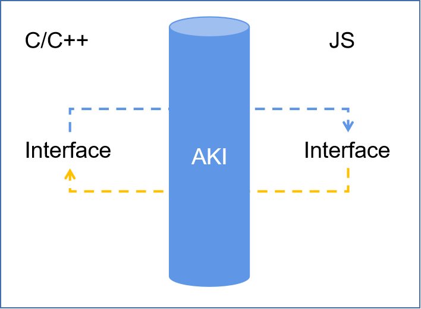

- [AKI项目介绍](#AKI-项目介绍)
- [快速接入](https://gitee.com/openharmony-sig/aki/blob/master/doc/quick-start.md)
- [用户指南](#用户指南)
- [用例demos](https://gitee.com/openharmony-sig/aki/blob/master/example/ohos/README.md)
- [Benchmark](#benchmark)

# AKI 项目介绍

**`AKI (Alpha Kernel Interacting)` 是一款边界性编程体验友好的ArkTs FFI开发框架，针对OpenHarmony Native开发提供JS与C/C++跨语言访问场景解决方案。支持极简语法糖使用方式，一行代码完成JS与C/C++的无障碍跨语言互调，所键即所得。**

## 优势

1. 极简使用，解耦FFI代码与业务代码，友好的边界性编程体验；
2. 提供完整的数据类型转换、函数绑定、对象绑定、线程安全等特性；
3. 支持JS & C/C++互调；
4. 支持与Node-API嵌套使用；

   


<table>
<tr>
	<th>Native C/C++ 业务代码: </th>
	<th>ArkTS 风格代码：</th>
</tr><tr>
<td valign="top">
<pre>#include &lt;string&gt;
#include &lt;aki/jsbind.h&gt;
&nbsp; 
// 类/结构体
struct Person {
    std::string SayHello();
    int age;
    std::string name;
    double weight;
};
&nbsp; 
// 全局函数
Person MakePerson() {
    Person person = {99, "aki", 128.8};
    return person;
}
&nbsp; 
// Aki JSBind语法糖
JSBIND_GLOBAL() {
    JSBIND_FUNCTION(MakePerson);
}
JSBIND_CLASS(Person) {
    JSBIND_CONSTRUCTOR&lt;int&gt;();
    JSBIND_METHOD(SayHello);
    JSBIND_PROPERTY(age);
    JSBIND_PROPERTY(name);
    JSBIND_PROPERTY(weight);
}
JSBIND_ADDON(&lt;Name&gt;)
</pre></td>
<td valign="top">
<pre>
import libaki from "lib&lt;Name&gt;.so"
&nbsp; 
// 调用 C/C++ Person 构造函数
let man = new libaki.Person(10);
&nbsp; 
// 访问类/结构体成员属性
console.log(man.age);
&nbsp; 
// 类/结构体成员函数
man.SayHello();
&nbsp;
// 调用 C/C++ 全局函数
let woman = libaki.MakePerson();
&nbsp;
// 极简使用，支持全类型转换
console.log(woman.name);
</pre></td>
</tr>
</table>

## 已测试兼容环境
* OpenHarmony(API 9) SDK (3.2.12.2): **通过**
* DevEco Studio (3.1.0.500): **通过**

-------------------------------------------

# 用户指南
* [快速接入](#quick_start)
* [JSBind语法糖](#jsbind)
  * [插件注册](#addon_register)
  * [全局函数](#bind_global_func)
  * [类构造函数](#bind_class_cons)
  * [类成员函数](#bind_class_method)
  * [类成员属性](#bind_class_property)
  * [枚举类型](#bind_enum)
  * [线程安全函数](#thread_safe)
* [类型转换](#type_conversion)
  * [Bool](#type_conversion_boolean)
  * [Number](#type_conversion_number)
  * [String](#type_conversion_string)
  * [Array](#type_conversion_array)
  * [ArrayBuffer](#type_conversion_array_buffer)
  * [JsonObject](#type_conversion_json_object)
  * [Function](#type_conversion_function)
  * [对象引用&指针](#type_conversion_reference)
* [API参考](#api_guilde)
  * [napi_env 获取](#napi_env)
  * TaskRunner - 待补充
  * [aki::Value](#aki_value)
  * aki::Promise - 待补充
  * [aki::ArrayBuffer](#array_buffer)
  * [aki::JSBind::BindSymbols: aki-NAPI混合开发](#aki_jsbind_bind_symbols)

## <a id="quick_start"> 快速接入 </a>

- [1 依赖配置](#1-依赖配置)
- [2 用户自定义业务](#2-用户自定义业务)
- [3 使用 AKI](#3-使用-aki)
- [4 编译构建使用](#4-编译构建使用)

### **1 依赖配置（2选1）**
* **源码依赖（推荐）**

  指定cpp路径下（如：项目根路径/entry/src/main/cpp）
    ```
    cd entry/src/main/cpp
    git clone https://gitee.com/openharmony-sig/aki.git
    ```
  CMakeLists.txt添加依赖（假定编译动态库名为:libhello.so）:

    ```cmake
    add_subdirectory(aki)
    target_link_libraries(hello PUBLIC aki_jsbind)
    ```
    
* **ohpm har包依赖**

  指定路径下（如：项目根路径/entry），输入如下命令安装ohpm har包依赖
    ```
    cd entry
    ohpm install @ohos/aki
    ```
  CMakeLists.txt添加依赖（假定编译动态库名为:libhello.so）:

    ```cmake
    set(AKI_ROOT_PATH ${CMAKE_CURRENT_SOURCE_DIR}/../../../oh_modules/@ohos/aki) # 设置AKI根路径
    set(CMAKE_MODULE_PATH ${AKI_ROOT_PATH})
    find_package(Aki REQUIRED)

    ...

    target_link_libraries(hello PUBLIC Aki::libjsbind) # 链接二进制依赖 & 头文件
    ```


### **2 用户自定义业务**

用户业务 C++ 代码 hello.cpp:<br>
全程无感`node-API`

```C++
#include <string>

std::string SayHello(std::string msg)
{
  return msg + " too.";
}

```

### **3 使用 AKI**

使用`JSBind`工具宏声明需要被绑定的类、函数：

```C++
#include <aki/jsbind.h>

// Step 1 注册 AKI 插件
JSBIND_ADDON(hello) // 注册 AKI 插件名: 即为编译*.so名称，规则与NAPI一致

// Step 2 注册 FFI 特性
JSBIND_GLOBAL()
{
  JSBIND_FUNCTION(SayHello);
}
```

### **4 编译构建使用**

OpenHarmony工程代码调用:

```javascript
import aki from 'libhello.so' // 工程编译出来的*.so

aki.SayHello("hello world");
```

## <a id="jsbind"> JSBind 语法糖 </a>

<table>
 <tr>
  <td> 语法糖 </td>
  <th colspan="2"> AKI </th>
  <td> 说明 </td>
 </tr>
 <tr>
  <td rowspan="2"> 插件注册 </td>
  <td> JS 访问 C++ </td>
  <td> JSBIND_ADDON </td>
  <td> 注册OpenHarmony Native 插件。 <br>
    <a href="#addon_register">使用指导</a> </td>
 </tr>
 <tr>
  <td> C++ 访问 JS </td>
  <td> aki::Value::FromGlobal </td>
  <td> 获取 JS 侧globalThis下的属性。 <br>
    <a href="https://gitee.com/openharmony-sig/aki/blob/master/doc/any.md#akivaluefromglobal">使用指导</a> </td>
 </tr>
 <tr>
  <td rowspan="2"> 全局函数 </td>
  <td> JS 访问 C++ </td>
  <td> JSBIND_FUNCTION <br> JSBIND_PFUNCTION</td>
  <td> 绑定 C++ 全局方法，JS 可调用。 <br>
    <a href="#bind_global_func">使用指导</a> </td>
 </tr>
 <tr>
  <td> C++ 访问 JS </td>
  <td> aki::Value::operator() </td>
  <td> JS 全局方法函数调用运算符，C++ 可调用。 <br>
    <a href="https://gitee.com/openharmony-sig/aki/blob/master/doc/any.md#akivalueoperator-1">使用指导</a> </td>
 </tr>
 <tr>
  <td rowspan="2"> 类构造函数 </td>
  <td> JS 访问 C++ </td>
  <td> JSBIND_CONSTRUCTOR<> </td>
  <td> 绑定 C++ 类构造函数，JS 可调用。构造函数可重载，需指定构造函数参数类型。<br>
    <a href="#bind_class_cons">使用指导</a> </td>
 </tr>
 <tr>
  <td> C++ 访问 JS </td>
  <td> - </td>
  <td> 暂不支持 </td>
 </tr>
 <tr>
  <td rowspan="2"> 类成员函数 </td>
  <td> JS 访问 C++ </td>
  <td> JSBIND_METHOD <br> JSBIND_PMETHOD </td>
  <td> 绑定 C++ 类成员函数，JS 可调用。<br>
    成员函数可以为：类静态函数，类成员函数，const类成员函数。<br>
    <a href="#bind_class_method">使用指导</a> </td>
 </tr>
 <tr>
  <td> C++ 访问 JS </td>
  <td> aki::Value::CallMethod </td>
  <td> 调用 JS 对象的成员函数。 <br>
    <a href="https://gitee.com/openharmony-sig/aki/blob/master/doc/any.md#akivaluecallmethod">使用指导</a> </td>
 </tr>
 <tr>
  <td rowspan="2"> 类成员属性 </td>
  <td> JS 访问 C++ </td>
  <td> JSBIND_PROPERTY <br> JSBIND_FIELD </td>
  <td> JSBIND_PROPERTY 绑定 C++类成员属性； <br>JSBIND_FIELD 绑定 C++ 类成员属性访问器（Get/Set）。<br>
    <a href="#bind_class_property">使用指导</a> </td>
 </tr>
 <tr>
  <td> C++ 访问 JS </td>
  <td> aki::Value::operator[] </td>
  <td> JS对象的属性访问运算符 <br> <a href="https://gitee.com/openharmony-sig/aki/blob/master/doc/any.md#akivalueoperator">使用指导</a></td>
 </tr>
 <tr>
  <td rowspan="2"> 枚举类型 </td>
  <td> JS 访问 C++ </td>
  <td> JSBIND_ENUM <br> JSBIND_ENUM_VALUE </td>
  <td> C/C++侧默认枚举类型为POD中的int32_t，JavaScript侧对应的枚举类型属性为readonly。<br>
    <a href="#bind_enum">使用指导</a> </td>
 </tr>
 <tr>
  <td> C++ 访问 JS </td>
  <td> - </td>
  <td> -</td>
 </tr>
</table>

### <a id="addon_register"> 插件注册 </a>

#### JSBIND_ADDON(addonName)

使用`JSBIND_ADDON`注册OpenHarmony Native 插件，可从 JavaScript `import` 导入插件。

**参数：**

|  **参数名**  | **类型** | **必填** | **说明** |
| ----------- | -------- | ------- | ------------------------ | 
| addonName   | -        | Y       | 注册的OpenHarmony native 插件名，可从 JavaScript `import lib${addonName}.so` 导入插件，插件名必须符合函数命名规则。 |

**示例：**
- C++

``` C++
#include <string>
#include <aki/jsbind.h>

JSBIND_ADDON(addon0)

```

- JavaScript

``` JavaScript
import addon from 'libaddon0.so' // 插件名为：addon0
```

#### JSBIND_ADDON_X(addonName constructorAlias)
用法与`JSBIND_ADDON`相似，用于支持插件名有特殊符号的场景，如包含'-'；

**参数：**

|  **参数名**  | **类型** | **必填** | **说明** |
| ----------- | -------- | ------- | ------------------------ | 
| addonName   | -        | Y       | 注册的OpenHarmony native 插件名，可从 JavaScript `import lib${addonName}.so` 导入插件，插件名可包含特殊符号，如：'-'。 |
| constructorAlias   | -        | Y       | 插件预构造函数名，只需填写符合函数命名规则名称即可，无其他特殊含义 |

**示例：**
- C++

``` C++
#include <string>
#include <aki/jsbind.h>

JSBIND_ADDON(hello-world, HelloWorld)

```

- JavaScript

``` JavaScript
import addon from 'libhello-world.so' // 插件名为：hello-world
```
### <a id="bind_global_func"> 绑定全局函数 </a>

#### JSBIND_GLOBAL

用于圈定需要绑定的全局函数 scope。

#### JSBIND_FUNCTION(func, alias)

在`JSBIND_GLOBAL`作用域下使用`JSBIND_FUNCTION`绑定 C++ 全局函数后，可从 JavaScript 直接调用。

* 调度线程为 JS 线程；

**参数：**

|  **参数名**  | **类型** | **必填** | **说明** |
| ----------- | -------- | ------- | ------------------------ | 
| func        | 函数指针  | Y       | 被绑定的`C++`函数指针，当alias未被指定时，`JavaScript`与`C++`函数名相同。 |
| alias       | string   | N       | 函数别名 |


**示例：**
- C++

``` C++
#include <string>
#include <aki/jsbind.h>

std::string SayHello(std::string msg)
{
    return msg + " too.";
}

JSBIND_GLOBAL()
{
    JSBIND_FUNCTION(SayHello);
}

JSBIND_ADDON(hello);
```

- JavaScript

``` JavaScript
import aki from 'libhello.so' // 插件名

let message = aki.SayHello("hello world");
```

#### JSBIND_PFUNCTION(func, alias)

使用`JSBIND_PFUNCTION`绑定 C++ 全局函数后，从 JavaScript 使用同Promise方式相同的异步调用。

* 调度线程为工作线程，由 ArkCompiler Runtime 决定；

**参数：**

|  **参数名**  | **类型** | **必填** | **说明** |
| ----------- | -------- | ------- | ------------------------ | 
| func        | 函数指针  | Y       | 被绑定的`C++`函数指针。   |
| alias       | string   | N       | 函数别名 |


**示例：**
- C++

``` C++

int AsyncTaskReturnInt() {
    // Do something;
    return -1;
}

JSBIND_GLOBAL() {
    JSBIND_PFUNCTION(AsyncTaskReturnInt);
}

JSBIND_ADDON(async_tasks);
```

- JavaScript

``` JavaScript
import libAddon from 'libasync_tasks.so'

libAddon.AsyncTaskReturnInt().then(res => {
  console.log('[AKI] AsyncTaskReturnInt: ' + res)
});

```
### <a id="bind_class_struct"> 绑定类/结构体 </a>

`AKI` 提供 `JSBIND_CLASS` 对 C++ `类/结构体`进行绑定，在`JSBIND_CLASS`作用域下可绑定：类构造函数、类成员函数、类成员属性的类特性。

#### <a id="bind_class"> JSBIND_CLASS(class) </a>

**参数：**

|  **参数名**  | **类型** | **必填** | **说明** |
| ----------- | -------- | ------- | ------------------------ | 
| class        | class/struct  | Y       | 被绑定的C++`类对象/结构体`，`JavaScript`与`C++`类名相同。 |

#### <a id="bind_class_cons"> JSBIND_CONSTRUCTOR\<T\>() </a>

在`JSBIND_CLASS`作用域下使用绑定 C++ 类/结构体构造函数，其中为了支持多态，可通过类型模板指定构造函数参数类型。
- `JSBIND_CONSTRUCTOR` 需要在`JSBIND_CLASS`的作用域下；

**参数：**

|  **参数名**  | **类型** | **必填** | **说明** |
| ----------- | -------- | ------- | ------------------------ | 
| T        | any  | N       | 构造函数参数类型，可变类型参数。 |

**示例：**
- C++

``` C++
#include <string>
#include <aki/jsbind.h>

class TestObject {
public:
    TestObject();
    
    explicit TestObject(double) {
        // ...
    }
    
    ~TestObject() = default;
} // TestObject

JSBIND_CLASS(TestObject)
{
    JSBIND_CONSTRUCTOR<>();
    JSBIND_CONSTRUCTOR<double>();
}
JSBIND_ADDON(hello);
```

- JavaScript

``` JavaScript
import aki from 'libhello.so' // 插件名

var obj1 = new aki.TestObject();
var obj2 = new aki.TestObject(3.14);
```

### <a id="bind_class_method"> 绑定类成员函数 </a>

#### JSBIND_METHOD(method)

`AKI` 使用 `JSBIND_METHOD` 对C++ 的3种类成员函数进行绑定：类静态函数、类成员函数、const 类成员函数。
* `JSBIND_METHOD` 需要在`JSBIND_CLASS`的作用域下；
* 调度线程为 JS 线程；

**参数：**

|  **参数名**  | **类型** | **必填** | **说明** |
| ----------- | -------- | ------- | ------------------------ | 
| method        | R (C::*)(P...)  | Y       | 同时支持类静态函数、类成员函数、const 类成员函数。 |

**示例：**

使用 `AKI` 对C++类成员函数绑定
``` C++
#include <string>
#include <aki/jsbind.h>

class TestObject {
public:
    TestObject();
    
    explicit TestObject(double) {
        // ...
    }
    
    ~TestObject() = default;
    
    static double MultiplyObject(TestObject obj1, TestObject obj2) {
        return obj1.value_ * obj2.value_;
    }
    
    double Multiply(double mult) {
        value_ *= mult;
        return value_;
    }

private:
    double value_;
} // TestObject

JSBIND_CLASS(TestObject)
{
    JSBIND_CONSTRUCTOR<>();
    JSBIND_CONSTRUCTOR<double>();
    JSBIND_METHOD(MultiplyObject);
    JSBIND_METHOD(Multiply);
}
JSBIND_ADDON(hello);
```

例：JavaScript 侧调用绑定的C++类成员函数

``` JavaScript
import aki from 'libhello.so' // 插件名

var obj1 = new aki.TestObject();
var obj2 = new aki.TestObject(3.14);
obj1.Multiply(-1);
aki.TestObject.MultiplyObject(obj1, obj2) // 静态方法
```

#### JSBIND_PMETHOD(method)

`JSBIND_PMETHOD`用于绑定 C++ 类成员函数，从 JavaScript 使用同Promise方式相同的异步调用。

* 调度线程为工作线程，由 ArkCompiler Runtime 决定；

**参数：**

|  **参数名**  | **类型** | **必填** | **说明** |
| ----------- | -------- | ------- | ------------------------ | 
| method       | 类成员函数指针  | Y       | 被绑定的`C++`类成员函数指针。   |

**示例：**

- C++

``` C++

class TaskRunner {
public:
    TaskRunner() = default;
    std::string DoTask() {
      // Do something;
      return "done.";
    }
};

JSBIND_CLASS(TaskRunner) {
    JSBIND_CONSTRUCTOR<>();
    JSBIND_PMETHOD(DoTask);
}

int AsyncTaskReturnInt() {
    // Do something;
    return -1;
}

JSBIND_GLOBAL() {
    JSBIND_PFUNCTION(AsyncTaskReturnInt);
}

JSBIND_ADDON(async_tasks);
```

- JavaScript

``` JavaScript
import libAddon from 'libasync_tasks.so'

let taskRunner = new libAddon.TaskRunner();
taskRunner.DoTask().then(res => {
  console.log('[AKI] DoTask: ' + res)
});

libAddon.AsyncTaskReturnInt().then(res => {
  console.log('[AKI] AsyncTaskReturnInt: ' + res)
});

```

### <a id="bind_class_property"> 绑定类成员属性 </a>

#### JSBIND_PROPERTY(property) <sup>new in 1.0.7</sup>

`AKI` 使用`JSBIND_PROPERTY`、`JSBIND_FIELD` 对 C++ 的类成员属性、类成员属性访问器进行绑定
- `JSBIND_PROPERTY`需要在`JSBIND_CLASS`的作用域下；

**参数：**

|  **参数名**  | **类型** | **必填** | **说明** |
| ----------- | -------- | ------- | ------------------------ | 
| property    |     T    | Y       | 类成员属性名。 |

**示例：**

``` C++
#include <string>
#include <aki/jsbind.h>

class TestObject {
public:    
    explicit TestObject(double) {
        // ...
    }
    
    ~TestObject() = default;

private:
    double value_;
} // TestObject

JSBIND_CLASS(TestObject)
{
    JSBIND_CONSTRUCTOR<double>();
    JSBIND_PROPERTY(value);
}
```

- JavaScript

``` JavaScript
import aki from 'libhello.so' // 插件名

var obj = new aki.TestObject(3.14);
obj.value = 1;
let value = obj.value;
```

#### JSBIND_FIELD(field, getter, setter)

`AKI` 使用`JSBIND_FIELD` 对 C++ 的类成员属性进行监听

* `JSBIND_FIELD` 需要在`JSBIND_CLASS`的作用域下；

* 调度线程为 JS 线程；

**参数：**

|  **参数名**  | **类型** | **必填** | **说明** |
| ----------- | -------- | ------- | ------------------------ | 
| field    | T  | Y       | 类成员属性名。 |
| getter    | T (void)  | Y       | get属性访问器。 |
| setter    | void (T)  | Y       | set属性访问器。 |

**示例：**
- C++

``` C++
#include <string>
#include <aki/jsbind.h>

class TestObject {
public:    
    explicit TestObject(double) {
        // ...
    }
    
    ~TestObject() = default;
    
    double GetValue() const {
        return value_;
    }

    void SetValue(double value) {
        value_ = value;
    }

private:
    double value_;
} // TestObject

JSBIND_CLASS(TestObject)
{
    JSBIND_CONSTRUCTOR<double>();
    JSBIND_FIELD("value", GetValue, SetValue);
}
```

- JavaScript

``` JavaScript
import aki from 'libhello.so' // 插件名

var obj = new aki.TestObject(3.14);
obj.value = 1;
let value = obj.value;
```

### <a id="bind_enum"> 绑定枚举类型 </a>

`JSBind`语法糖`JSBIND_ENUM`、`JSBIND_ENUM_VALUE`支持绑定 C/C++ 枚举类型，映射为 JavaScript 的Number类型。

- C/C++侧默认枚举类型为POD中的int32_t；
- JavaScript侧对应的枚举类型属性为`readonly`；

#### JSBIND_ENUM(enum)

**参数：**

|  **参数名**  | **类型** | **必填** | **说明** |
| ----------- | -------- | ------- | ------------------------ | 
| enum        | enum  | Y       | 被绑定的`C++`枚举类型。 |

#### JSBIND_ENUM_VALUE(value)

**参数：**

|  **参数名**  | **类型** | **必填** | **说明** |
| ----------- | -------- | ------- | ------------------------ | 
| value        | enum::value  | Y       | 被绑定的`C++`枚举值。 |

**示例：**
- C++

``` C++
#include <string>
#include <aki/jsbind.h>

enum TypeFlags {
    NONE,
    NUM,
    STRING,
    BUTT = -1
};

JSBIND_ENUM(TypeFlags) {
    JSBIND_ENUM_VALUE(NONE);
    JSBIND_ENUM_VALUE(NUM);
    JSBIND_ENUM_VALUE(STRING);
}

TypeFlags Passing(TypeFlags flag) {
    return flag;
}

JSBIND_GLOBAL()
{
    JSBIND_FUNCTION(Passing);
}

JSBIND_ADDON(enumeration);
```

- JavaScript

``` JavaScript
import libAddon from 'libenumeration.so' // 插件名


console.log('AKI libAddon.TypeFlags.NONE = ' + libAddon.TypeFlags.NONE);
console.log('AKI libAddon.TypeFlags.NUM = ' + libAddon.TypeFlags.NUM);
console.log('AKI libAddon.TypeFlags.Passing() = ' + libAddon.Foo(libAddon.TypeFlags.STRING));
try {
  libAddon.TypeFlags.NUM = 10; // TypeError: Cannot set readonly property
} catch (error) {
  console.error('AKI catch: ' + error);
}
```

---

### <a id="thread_safe"> 线程安全函数 </a>

使用`AKI`的线程安全特性，绑定 JavaScript 的业务函数后，可由`native`直接调用。

- **线程安全**：使用`AKI`线程安全绑定的 JavaScript 函数是线程安全的，可在非JS线程直接调用。最终会由框架调度JS线程执行业务；
- **阻塞式调用**：C++ 触发调用 JavaScript 函数的调用是阻塞式的，对于在JS线程执行业务这点没有疑义。但当C++触发 JavaScript 业务调用的线程是非JS线程时，就存在跨线程任务调度。此时由框架进行了阻塞式调用，即 C++ 会等待 JavaScript 函数执行结束后返回；

#### JSBind.bindFunction(name: string, func: function)

在 JavaScript 使用 `JSBind.bindFunction` 绑定 JavaScript 全局函数后，可从 C++ 直接调用。

**参数：**

|  **参数名**  | **类型** | **必填** | **说明** |
| ----------- | -------- | ------- | ------------------------ | 
| name        | string   | Y       | 指定绑定的`JavaScript`函数名，用于Native索引。 |
| func        | function | Y       | 被绑定的`JavaScript`函数 |

**返回值：**

| **类型** | **说明** |
| ----------- | -------- |
| number      | 当前被绑定的函数下标索引   |

``` JavaScript
// name: 指定函数名，func: JavaScript 全局函数
libAddon.JSBind.bindFunction(name: string, func: Function);
```

C++ 使用aki::JSBind::GetJSFunction获取指定 JavaScript 函数句柄后，使用Invoke触发调用

``` C++
auto jsFunc = aki::JSBind::GetJSFunction("xxx"); // 获取指定函数句柄
auto result = jsFunc->Invoke<T>(...); // 调用JavaScript函数，Invoke<T>指定返回值类型
```

- JavaScript

``` JavaScript
import libAddon from 'libhello.so' // 插件名

function sayHelloFromJS (value) {
  console.log('what do you say: ' + value);
  return "hello from JS"
}

libAddon.JSBind.bindFunction("sayHelloFromJS", sayHelloFromJS);
```

- C++

``` C++
#include <string>
#include <aki/jsbind.h>

void DoSomething() {
    // 索引 JS 函数句柄
    auto jsFunc = aki::JSBind::GetJSFunction("sayHelloFromJS");

    // Invoke 指定 JS 方法的返回值类型
    auto result = jsFunc->Invoke<std::string>("hello from C++"); // 可在非JS线程执行
    // result == "hello from JS"
}
```

查看示例：[bind_from_js](https://gitee.com/openharmony-sig/aki/tree/master/example/ohos/5_bind_from_js)

-------------------------------

## <a id="type_conversion"> 类型转换 </a>

|  **JavaScript**  | **C++** | 
| ---------------- | ------------------------ | 
| Boolean          | `bool`  <br> [参考](https://gitee.com/openharmony-sig/aki/blob/master/doc/type-conversion.md#boolean)                                     |
| Number           | `uint8_t`, `int8_t`, `uint16_t`, `int16_t`, `short`, `int32`, `uint32`, `int64`, `float`, `double`, `enum` <br> [参考](https://gitee.com/openharmony-sig/aki/blob/master/doc/type-conversion.md#number) |
| String           | `const char*`, `std::string` <br> [参考](https://gitee.com/openharmony-sig/aki/blob/master/doc/type-conversion.md#string)                |
| Array            | `std::vector<T>`, `std::array<T, N>` <br> [参考](https://gitee.com/openharmony-sig/aki/blob/master/doc/type-conversion.md#array)            |
| Function         | `std::function<R (P...)>` <br> `aki::Callbackn<R (P...)>` <br> `aki::SafetyCallbackn<R (P...)>` <br> [参考](https://gitee.com/openharmony-sig/aki/blob/master/doc/type-conversion.md#function) |
| Class Object      | `class`                                     |
| JsonObject       | `std::map<std::string,T>` <br> [参考](https://gitee.com/openharmony-sig/aki/blob/master/doc/type-conversion.md#jsonobject)                                  |
| ArrayBuffer, <br> TypedArray      | `aki::ArrayBuffer` <br> [参考](https://gitee.com/openharmony-sig/aki/blob/master/doc/type-conversion.md#arrarbuffer)  |
| Promise          | `JSBIND_PFUNCTION`, `JSBIND_PMETHOD` |
| any          | `aki::Value`, `napi_value` |

NOTE: 带有阴影部分的表示已支持

`const char*` 是以引用方式传递参数，如遇到异步操作，请使用传值方式：std::string

### <a id="type_conversion_boolean"> Boolean </a>

如下示例，开发者直接声明函数入参及返回值类型，使用`AKI`绑定后，框架自适应对 C/C++ 的 `bool` 及 JavaScript 的 `Boolean` 类型进行转化。

**示例：**

- C++

  ``` C++
  #include <aki/jsbind.h>
  bool Foo(bool flag) {
    ...
    return true;
  }
  JSBIND_GLOBAL() {
      JSBIND_FUNCTION(Foo, "foo");
  }
  JSBIND_ADDON(hello)
  ```

- JavaScript

  ``` JavaScript
  import libAddon from 'libhello.so'
  let flag = libAddon.foo(true);
  ```

### <a id="type_conversion_number"> Number </a>

如下示例，开发者直接声明函数入参及返回值类型，使用`AKI`绑定后，框架自适应对 C/C++ 的 `uint8_t`, `int8_t`, `uint16_t`, `int16_t`, `short`, `int32`, `uint32`, `int64`, `float`, `double`, `enum` 及 JavaScript 的 `Number` 类型进行转化。

* `float:` 浮点型转换时存在精度丢失，对于高精度场景，请使用 `double`；
* `enum:` 枚举类型的转化请[参考](https://gitee.com/openharmony-sig/aki/blob/master/doc/bind_enum.md)

**示例：**

- C++

  ``` C++
  #include <aki/jsbind.h>
  int Foo(int num) {
    ...
    return 666;
  }
  JSBIND_GLOBAL() {
      JSBIND_FUNCTION(Foo, "foo");
  }
  JSBIND_ADDON(hello)
  ```

- JavaScript

  ``` JavaScript
  import libAddon from 'libhello.so'
  let num = libAddon.foo(888);
  ```

### <a id="type_conversion_string"> String </a>

如下示例，开发者直接声明函数入参及返回值类型，使用`AKI`绑定后，框架自适应对 C/C++ 的 `const char*`, `std::string` 及 JavaScript 的 `String` 类型进行转化。

* `const char*` 是以引用方式传递参数，如遇到异步操作，请使用传值方式：std::string；

**示例：**

- C++

  ``` C++
  #include <aki/jsbind.h>
  std::string Foo(const char* c_str, std::string str) {
    ...
    return "AKI 666";
  }
  JSBIND_GLOBAL() {
      JSBIND_FUNCTION(Foo, "foo");
  }
  JSBIND_ADDON(hello)
  ```

- JavaScript

  ``` JavaScript
  import libAddon from 'libhello.so'
  let str = libAddon.foo("AKI", "666");
  ```

### <a id="type_conversion_array"> Array </a>

如下示例，开发者直接声明函数入参及返回值类型，使用`AKI`绑定后，框架自适应对 C/C++ 的 `std::vector<T>`, `std::array<T, N>` 及 JavaScript 的 `[]` 类型进行转化。

* 数组类型仅支持**同种类型**的数组声明；

**示例：**

- C++

  ``` C++
  #include <aki/jsbind.h>
  std::vector<double> Foo(std::array<int, 3>) {
    std::vector<double> result;
    ...
    return result;
  }
  JSBIND_GLOBAL() {
      JSBIND_FUNCTION(Foo, "foo");
  }
  JSBIND_ADDON(hello)
  ```

- JavaScript

  ``` JavaScript
  import libAddon from 'libhello.so'
  let array = libAddon.foo([1, 2, 3]);
  ```

### <a id="type_conversion_array_buffer"> ArrarBuffer </a>

二进制数据缓冲区`ArrayBuffer`, `TypedArray` 是 JavaScript AKI 提供了内建结构体：`aki::ArrayBuffer`用来支持该特性：

- `GetData()*` 获取 ArrayBuffer 数组缓冲区地址，aki::ArrayBuffer 本身不申请数据内存，data 都来源于JavaScript引擎分配的内存，也无需做内存生命周期管理，**禁止对该内存进行危险的释放**。

- `GetLength()` 获取 ArrayBuffer 数组缓冲区长度，以单字节为计量单位。

- `GetTyped()` 获取 ArrayBuffer 数组缓冲区的类型化类型。

- `GetCount()` 获取 ArrayBuffer 数组缓冲区的类型化数据元素个数。

**示例：**

- C++

``` C++
#include <aki/jsbind.h>
aki::ArrayBuffer PassingArrayBufferReturnArrayBuffer(aki::ArrayBuffer origin) {
    aki::ArrayBuffer buff(origin.GetData(), origin.GetCount());
    uint8_t* data = buff.GetData();
    data[4] = 4;
    data[5] = 5;
    data[6] = 6;
    data[7] = 7;

    return buff;
}
```

- JavaScript

``` JavaScript
import libAddon from 'libarraybuffer2native.so'

let buff: ArrayBuffer = new ArrayBuffer(8);
let uint8Buff1: Uint8Array = new Uint8Array(buff);
uint8Buff1[0] = 0;
uint8Buff1[1] = 1;
uint8Buff1[2] = 2;
uint8Buff1[3] = 3;
let result: ArrayBuffer = libAddon.PassingArrayBufferReturnArrayBuffer(buff);
uint8Buff1 = new Uint8Array(result);
let message: String = uint8Buff1.toString();
```

### <a id="type_conversion_json_object"> JsonObject </a>

JavaScript支持使用`JsonObject`表示key-value结构的数据类型，如：
```javascript
{
  name: 'hanmeimei',
  age: '17',
  date: '1999-02-02'
}
```
`AKI`支持使用C/C++的`std::map<std::string, T>`映射JavaScript的`JsonObject`。

  - 与`std::map<std::string, T>`对应的`JsonObject`必须约束value类型一致

- [Example](https://gitee.com/openharmony-sig/aki/tree/master/example/ohos/10_map_for_object)

- C++

``` C++
void Foo(std::map<std::string, int> obj)
{
    for (auto& iter : obj) {
        ......; // key: iter.first; value: iter.second
    }
}

JSBIND_GLOBAL() {
    JSBIND_FUNCTION(Foo);
}
```

- JavaScript

``` JavaScript
import libmap_for_object from 'libmap_for_object.so'

let a = {age: 100};
libmap_for_object.Foo(a);
```

### <a id="type_conversion_function"> Function </a>

Function是JS的一种基本数据类型，当JS传入Function作为参数时，Native可在适当的时机调用触发回调。`AKI` 支持如下3中C++数据类型作为参数处理回调：

- aki::Callback<R (P...)>：指定回调类型为`R (*)(P...)`的**高性能**回调。**非线程安全，禁止在非JS线程使用**，否则会发生异常；
- aki::SafetyCallback<R (P...)>：指定回调类型为`R (*)(P...)`的线程安全回调。因为需要创建线程安全资源，所以性能不如aki::Callback；
- std::function<R (P...)>：用法与aki::SafetyCallback一致；

### <a id="type_conversion_reference"> 对象引用&指针 </a>

C++ 对象作为参数和返回类型，在 C++ & JavaScript 代码中可以使用如下形式进行传递：
- 值传递；
- 引用（T&）与指针（T*）传递；
- [Example](https://gitee.com/openharmony-sig/aki/tree/master/example/ohos/14_reference_and_pointer)

-------------------------------------------------------

## <a id="api_guilde"> API参考 </a>

### <a id="napi_env"> napi_env 获取 </a>

```C++
static napi_env aki::JSBind::GetScopedEnv();
```

线程安全函数，用于获取当前线程的 napi_env 对象。当在非 JS 线程调用时，返回 nullptr。

**参数：**
|  **参数名**  | **类型** | **必填** | **说明** |
| ----------- | -------- | ------- | ------------------------ | 
| key   | string        | Y       | 需要读取的属性名。 |

**示例：**
```C++
// 在 JS 线程执行
napi_value obj;
napi_env env = aki::JSBind::GetScopedEnv();
napi_create_object(env, &obj);
```

### <a id="task_runner"> TaskRunner 任务调度器 </a>

`TaskRunner`提供JS线程的任务调度器，开发人员可以很方便地往JS线程`PostTask`

#### <a id="task_runner_post_task"> PostTask </a>

```C++
static void PostTask(const std::string& runnerName, Closure task);
```

静态函数，往指定任务调度器，投递任务。

**参数：**
|  **参数名**  | **类型** | **必填** | **说明** |
| ----------- | -------- | ------- | ------------------------ | 
| runnerName   | string        | Y       | 指定任务调度器。 |
| task   | Closure        | Y       | 任务表达式: std::function<void ()>。 |

**示例：**
```C++

void foo ()
{
    aki::TaskRunner::PostTask("main", [] () {
      // 在 JS 线程执行
      // do something
    });
}
```

### <a id="aki_value"> aki::Value <sup> v1.2.0 </sup> </a>

JavaScript 是弱类型语言，可用泛型`any`表示任意类型。C/C++使用`aki::Value`映射 JavaScript 的`any`类型

#### <a id="aki_value_from_global"> aki::Value::FromGlobal </a>

```C++
static Value FromGlobal(const char* key = nullptr)
```

用于获取 JS 侧`globalThis`下的属性。

**参数：**
|  **参数名**  | **类型** | **必填** | **说明** |
| ----------- | -------- | ------- | ------------------------ | 
| key   | string        | Y       | 需要读取的属性名。 |

**返回值：**
| **类型** | **说明** |
| -------- | ------------------------ | 
| aki::Value | 对应属性的 JS 对象句柄。 |

**示例：**
```C++
  // 获取globalThis.JSON
  aki::Value json = aki::Value::FromGlobal("JSON");
  json["stringify"](obj);
```

#### <a id="aki_value_as"> aki::Value::As </a>

```C++
template<typename T>
T As() const;
```
模板函数，用于将 JS 对象转化为 C/C++ 指定数据类型

**参数：**
|  **参数名**  | **类型** | **必填** | **说明** |
| ----------- | -------- | ------- | ------------------------ | 
| T   | any        | Y       | 需要被转化的 C/C++ 数据类型。 |

**返回值：**
| **类型** | **说明** |
| -------- | ------------------------ | 
| T | 对应类型的值。 |

**示例：**
```C++
  value.As<bool>(); // 将 JS 对象 value 转化为 bool
  value.As<int>(); // 将 JS 对象 value 转化为 int
  value.As<std::string>(); // 将 JS 对象 value 转化为 string
```

#### <a id="aki_value_get_handle"> aki::Value::GetHandle </a>

```C++
napi_value GetHandle() const
```
用于获取 JS 对象的 napi_value 句柄。

**返回值：**
| **类型** | **说明** |
| -------- | ------------------------ | 
| napi_value | JS 对象的 napi_value 句柄。 |

#### <a id="aki_value_call_method"> aki::Value::CallMethod </a>

```C++
template<typename... Args>
Value CallMethod(const char* name, Args&&... args)
```

调用 JS 对象的成员函数。

**参数：**
|  **参数名**  | **类型** | **必填** | **说明** |
| ----------- | -------- | ------- | ------------------------ | 
| name   | string        | Y       | 函数名。 |
| args   | any        | N       | 成员函数接收的参数。 |

**返回值：**
| **类型** | **说明** |
| -------- | ------------------------ | 
| aki::Value | 返回泛型对象。 |

**示例：**
```C++
  // value 映射为 JS 数组对象 let value = ['aki'];
  // 调用 value.push('jsbind');
  value.CallMethod("push", "jsbind");
```

#### aki::Value::operator[]

```C++    
Value operator[](const std::string& key) const;
Value operator[](const size_t index) const;
```
`aki::Value`对象的下标运算符

**参数：**
|  **参数名**  | **类型** | **必填** | **说明** |
| ----------- | -------- | ------- | ------------------------ | 
| key   | string        | Y       | 属性名下标。 |
| index   | size_t        | Y       | 数组下标。 |

**返回值：**
| **类型** | **说明** |
| -------- | ------------------------ | 
| aki::Value | 返回泛型对象。 |

**示例：**
```C++
  // value 映射为 JS 数组对象 let value = ['aki', 'jsbind'];
  // 访问下标为0的值：'aki';
  aki::Value str = value[0]; // str = "aki"

  // 调用 JSON.stringify(...);
  aki::Value::FromGlobal("JSON")["stringify"](...);
```

#### aki::Value::operator()

```C++    
template<typename... Args>
Value operator()(Args&&... args) const;
```
`aki::Value`对象的函数调用运算符

**参数：**
|  **参数名**  | **类型** | **必填** | **说明** |
| ----------- | -------- | ------- | ------------------------ | 
| args   | any        | N       | 函数所接收入参。 |

**返回值：**
| **类型** | **说明** |
| -------- | ------------------------ | 
| aki::Value | 返回泛型对象。 |

**示例：**
```C++
  // 调用 JSON.parse({'aki': 'jsinbd'});
  aki::Value::FromGlobal("JSON")["parse"]({"aki": "jsinbd"});
```

#### aki::Value::Set

```C++
template<typename V>
void Set(const char* key, const V& value);
```
用于给`aki::Value`泛型对象属性设值。

**参数：**
|  **参数名**  | **类型** | **必填** | **说明** |
| ----------- | -------- | ------- | ------------------------ | 
| key   | string        | Y       | 属性名。 |
| value   | any        | Y       | 属性值。 |

**示例：**
```C++
  // value 为 JS 对象;
    value.Set("name", "aki");
```

#### aki::Value::NewObject

```C++
static Value NewObject();
```
创建`aki::Value`泛型对象。

**返回值：**
| **类型** | **说明** |
| -------- | ------------------------ | 
| aki::Value | 返回泛型对象。 |

**示例：**
```C++
  aki::Value val = aki::Value::NewObject();
  val.Set("name", "aki"); // {'name': 'aki'};
```

#### aki::Value::IsUndefined

```C++
bool IsUndefined() const
```

判断 JS 对象类型是否为`undefined`。

**返回值：**
| **类型** | **说明** |
| -------- | ------------------------ | 
| bool | true or false。 |

#### aki::Value::IsNull

```C++
bool IsNull() const
```

判断 JS 对象类型是否为`null`。

**返回值：**
| **类型** | **说明** |
| -------- | ------------------------ | 
| bool | true or false。 |

#### aki::Value::IsBool

```C++
bool IsBool() const
```

判断 JS 对象类型是否为`boolean`。

**返回值：**
| **类型** | **说明** |
| -------- | ------------------------ | 
| bool | true or false。 |

#### aki::Value::IsNumber

```C++
bool IsNumber() const
```

判断 JS 对象类型是否为`number`。

**返回值：**
| **类型** | **说明** |
| -------- | ------------------------ | 
| bool | true or false。 |

#### aki::Value::IsString

```C++
bool IsString() const
```

判断 JS 对象类型是否为`string`。

**返回值：**
| **类型** | **说明** |
| -------- | ------------------------ | 
| bool | true or false。 |

#### aki::Value::IsArray

```C++
bool IsArray() const
```

判断 JS 对象类型是否为数组`[]`。

**返回值：**
| **类型** | **说明** |
| -------- | ------------------------ | 
| bool | true or false。 |

#### aki::Value::IsFunction

```C++
bool IsFunction() const
```

判断 JS 对象类型是否为`function`。

**返回值：**
| **类型** | **说明** |
| -------- | ------------------------ | 
| bool | true or false。 |


#### C/C++ 调用 @ohos.bundle.bundleManager (bundleManager模块)特性

示例：

- 期望在 C++ 调用如下@ohos.bundle.bundleManager (bundleManager模块) 特性：
  
  如下`ArkTS`代码为[@ohos.bundle.bundleManager 示例](https://docs.openharmony.cn/pages/v3.2/zh-cn/application-dev/reference/apis/js-apis-bundleManager.md/)
  ```JavaScript
  import bundleManager from '@ohos.bundle.bundleManager';
  import hilog from '@ohos.hilog';
  let bundleFlags = bundleManager.BundleFlag.GET_BUNDLE_INFO_DEFAULT;
  try {
      bundleManager.getBundleInfoForSelf(bundleFlags).then((data) => {
          hilog.info(0x0000, 'testTag', 'getBundleInfoForSelf successfully. Data: %{public}s', JSON.stringify(data));
      }).catch(err => {
          hilog.error(0x0000, 'testTag', 'getBundleInfoForSelf failed. Cause: %{public}s', err.message);
      });
  } catch (err) {
      hilog.error(0x0000, 'testTag', 'getBundleInfoForSelf failed: %{public}s', err.message);
  }
  ```
  使用如下`C++`代码实现上述功能
  ```C++
    /* 要求在ArkTS侧执行如下代码：
    * import bundleManager from '@ohos.bundle.bundleManager';
    * globalThis.bundleManager = bundleManager;
    */
    aki::Value bundleManager = aki::Value::FromGlobal("bundleManager");
    
    /* 如下 C++ 代码等同于 JS 代码:
    * let bundleFlags = bundleManager.BundleFlag.GET_BUNDLE_INFO_DEFAULT;
    * bundleManager.getBundleInfoForSelf(bundleFlags).then((data) => {
    *   console.log('getBundleInfoForSelf successfully. Data:', JSON.stringify(data));
    * })
    */
    std::function<void(aki::Value)> thenFunc = [](aki::Value data) {
        AKI_LOG(INFO) << aki::Value::FromGlobal("JSON")["stringify"](data).As<std::string>();
    };
    int bundleFlags = bundleManager["BundleFlag"]["GET_BUNDLE_INFO_DEFAULT"].As<int>();
    bundleManager["getBundleInfoForSelf"](bundleFlags).CallMethod("then", thenFunc);
  ```

- [Example](https://gitee.com/openharmony-sig/aki/tree/master/example/ohos/15_aki_value)


### <a id="array_buffer"> aki::ArrayBuffer </a>

#### constructor
* 当在非 JS 线程使用 aki::ArrayBuffer，需要关注数据字节流生命周期，并考虑是否需要结合`Commit()`函数使用。

```C++
ArrayBuffer(uint8_t* ptr, size_t len, Typed typed = BUFF)
```

**参数：**
|  **参数名**  | **类型** | **必填** | **说明** |
| ----------- | -------- | ------- | ------------------------ | 
| ptr         | uint8_t* | Y       | 构造 ArrayBuffer 的数据字节流内存地址。 |
| len         | size_t | Y       | 构造 ArrayBuffer 的数据字节流内存长度。 |
| typed         | aki::ArrayBuffer::Typed | N       | 构造的 ArrayBuffer \| TypedArray 类型，默认为 ArrayBuffer。 |

**示例：**
```C++
uint8_t temp[4] = {10, 20, 30, 40};
aki::ArrayBuffer arrayBuffer(temp, 4);
```

#### GetData
```C++
uint8_t* GetData()
```
获取 ArrayBuffer 的数据字节流内存地址。

**返回值：**
| **类型** | **说明** |
| -------- | ------------------------ | 
| uint8_t* | ArrayBuffer 的数据字节流内存地址。 |

#### GetLength
```C++
size_t GetLength()
```
获取 ArrayBuffer 的数据字节流内存长度。

**返回值：**
| **类型** | **说明** |
| -------- | ------------------------ | 
| size_t | ArrayBuffer 的数据字节流内存长度。 |

#### Commit
```C++
void Commit()
```
当在非 JS 线程使用 ArrayBuffer 时，如果数据字节流的内存生命周期在 ArrayBuffer 使用前结束，则需要暂存。

**返回值：**
| **类型** | **说明** |
| -------- | ------------------------ | 
| size_t | ArrayBuffer 的数据字节流内存长度。 |

**示例：**
```C++
// 非 JS 线程
aki::ArrayBuffer AsyncTaskReturnArrayBufferWithCommit() {
    uint8_t temp[4] = {10, 20, 30, 40};
    aki::ArrayBuffer arrayBuffer(temp, 4);
    arrayBuffer.Commit();
    return arrayBuffer;
}
```

### <a id="aki_jsbind_bind_symbols"> AKI hybrid Node-API 混合开发 </a>

`AKI` 支持与 Node-API 混合开发。接口 `aki::JSBind::BindSymbols` 用于绑定使用 `AKI` 的 Native 符号表给指定的 napi_value 对象。

如下示例：

examples/ohos/4_hybrid_napi/entry/src/main/hello.cpp
```C++
EXTERN_C_START
static napi_value Init(napi_env env, napi_value exports)
{
    napi_property_descriptor desc[] = {
        ...
    };
    napi_define_properties(env, exports, sizeof(desc) / sizeof(desc[0]), desc);
    
    exports = aki::JSBind::BindSymbols(env, exports); // aki::JSBind::BindSymbols 函数传入 js 对象绑定符号
    return exports;
}
EXTERN_C_END
```

## <a id="benchmark"> Benchmark </a>

* IDE： DevEco Studio 3.1.1.130
* SDK：3.2.10.6

API接口压测，当前采用了OHOS上单元测试框架的数据驱动能力，详见benchmark

<table>
 <tr>
  <td> API </td>
  <td> 调用次数 </td>
  <td> AKI (ms) </td>
  <td> Node-API (ms) </td>
 </tr>
 <tr>
  <td> bool (*)() </td>
  <td> 10000 </td>
  <td> 0.0032 </td>
  <td> 0.0031 </td>
 </tr>
 <tr>
  <td> string (*)(string) </td>
  <td> 10000 </td>
  <td> 0.0058 </td>
  <td> 0.0057 </td>
 </tr>
 <tr>
  <td> void (*)( std::function )  </td>
  <td> 10000 </td>
  <td> 0.0667 </td>
  <td rowspan="3"> 0.0176 </td>
 </tr>
 <tr>
  <td> void (*)( aki::Callback )  </td>
  <td> 10000 </td>
  <td> 0.0178 </td>
 </tr>
 <tr>
  <td> void (*)( aki::SafetyCallback )  </td>
  <td> 10000 </td>
  <td> 0.0664 </td>
 </tr>
</table>

# 如何反馈

* issue

# 如何贡献
* 贡献代码

